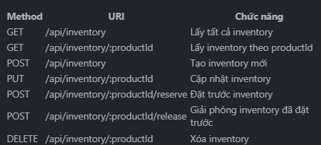

Augment

API của Inventory Service
Dưới đây là danh sách các API của Inventory Service, bao gồm URI, chức năng, input và output:

1. Lấy tất cả inventory
   URI: GET /api/inventory
   Chức năng: Lấy danh sách tất cả các bản ghi inventory
   Input: Không có

[
{
"_id": "65f1a1f7c1b5cb2c3c2a1b1a",
"productId": "65f1a1f7c1b5cb2c3c2a1b1a",
"availableQuantity": 50,
"reservedQuantity": 0,
"lastUpdated": "2023-05-18T10:30:00.000Z"
},
{
"_id": "65f1a1f7c1b5cb2c3c2a1b1b",
"productId": "65f1a1f7c1b5cb2c3c2a1b1b",
"availableQuantity": 30,
"reservedQuantity": 0,
"lastUpdated": "2023-05-18T10:30:00.000Z"
}
// ...
]

2. Lấy inventory theo productId
   URI: GET /api/inventory/:productId
   Chức năng: Lấy thông tin inventory của một sản phẩm cụ thể
   Input: productId trong URL
   Output:
   {
   "\_id": "65f1a1f7c1b5cb2c3c2a1b1a",
   "productId": "65f1a1f7c1b5cb2c3c2a1b1a",
   "availableQuantity": 50,
   "reservedQuantity": 0,
   "lastUpdated": "2023-05-18T10:30:00.000Z"
   }

3. Tạo mới inventory
   URI: POST /api/inventory
   Chức năng: Tạo một bản ghi inventory mới cho sản phẩm
   Input:
   Input
   {
   "productId": "65f1a1f7c1b5cb2c3c2a1b1a",
   "availableQuantity": 50,
   "reservedQuantity": 0
   }
   Output:
   {
   "\_id": "65f1a1f7c1b5cb2c3c2a1b1a",
   "productId": "65f1a1f7c1b5cb2c3c2a1b1a",
   "availableQuantity": 50,
   "reservedQuantity": 0,
   }

4. Cập nhật inventory
   URI: PUT /api/inventory/:productId
   Chức năng: Cập nhật thông tin inventory của một sản phẩm
   Input:
   {
   "availableQuantity": 50,
   "reservedQuantity": 0
   }
   Output:
   {
   "\_id": "65f1a1f7c1b5cb2c3c2a1b1a",
   "productId": "65f1a1f7c1b5cb2c3c2a1b1a",
   "availableQuantity": 50,
   "reservedQuantity": 0,
   "lastUpdated": "2023-05-18T10:30:00.000Z"
   }

5. Xóa inventory
   URI: DELETE /api/inventory/:productId
   Chức năng: Xóa một bản ghi inventory của một sản phẩm
   Input: productId trong URL
   Output: Không có

6. Đặt hàng
   URI: POST /api/inventory/:productId/reserve
   Chức năng: Đặt hàng một số lượng sản phẩm
   Input:
   {
   "quantity": 10
   }
   Output:
   {
   "\_id": "65f1a1f7c1b5cb2c3c2a1b1a",
   "productId": "65f1a1f7c1b5cb2c3c2a1b1a",
   "availableQuantity": 40,
   "reservedQuantity": 10,
   "lastUpdated": "2023-05-18T10:30:00.000Z"
   }

7. Hủy đặt hàng
   URI: POST /api/inventory/:productId/release
   Chức năng: Hủy đặt hàng một số lượng sản phẩm
   Input:
   {
   "quantity": 10
   }
   Output:
   {
   "\_id": "65f1a1f7c1b5cb2c3c2a1b1a",
   "productId": "65f1a1f7c1b5cb2c3c2a1b1a",
   "availableQuantity": 50,
   "reservedQuantity": 0,
   "lastUpdated": "2023-05-18T10:30:00.000Z"
   }

8. Cập nhật số lượng tồn kho
   URI: PUT /api/inventory/:productId/quantity
   Chức năng: Cập nhật số lượng tồn kho của một sản phẩm
   Input:
   {
   "quantity": 100,
   "operation": "SET" // hoặc "ADD", "SUBTRACT"
   }
   Output:
   {
   "\_id": "65f1a1f7c1b5cb2c3c2a1b1a",
   "productId": "65f1a1f7c1b5cb2c3c2a1b1a",
   "availableQuantity": 100,
   "reservedQuantity": 0,
   "lastUpdated": "2023-05-18T10:30:00.000Z"
   }

   Khi sử dụng operation "SET":
Cập nhật tổng số lượng trong kho (availableQuantity + reservedQuantity)
Giữ nguyên reservedQuantity
Tính toán lại availableQuantity = tổng số lượng - reservedQuantity
Khi sử dụng operation "ADD" hoặc "SUBTRACT":
Chỉ thay đổi availableQuantity, không ảnh hưởng đến reservedQuantity

Method URI Chức năng
GET /api/inventory Lấy tất cả inventory
GET /api/inventory/:productId Lấy inventory theo productId
POST /api/inventory Tạo inventory mới
PUT /api/inventory/:productId Cập nhật inventory
POST /api/inventory/:productId/reserve Đặt trước inventory
POST /api/inventory/:productId/release Giải phóng inventory đã đặt trước
DELETE /api/inventory/:productId Xóa inventory

