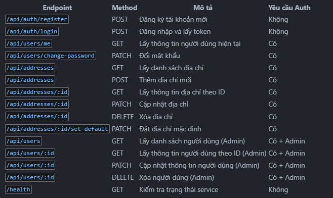

{
"api": {
"title": "User Service API Documentation",
"version": "1.0.0",
"description": "API documentation for the User Service of the E-commerce System",
"baseUrl": "http://localhost:8003",
"authentication": {
"type": "JWT",
"header": "Authorization: Bearer {token}"
},
"endpoints": [
{
"name": "Register User",
"method": "POST",
"path": "/api/auth/register",
"description": "Register a new user account",
"requestBody": {
"username": "user123",
"email": "user@example.com",
"password": "password123",
"firstName": "John",
"lastName": "Doe",
"phoneNumber": "0123456789"
},
"response": {
"status": 201,
"body": {
"status": "success",
"token": "eyJhbGciOiJIUzI1NiIsInR5cCI6IkpXVCJ9...",
"data": {
"user": {
"\_id": "60d21b4667d0d8992e610c85",
"username": "user123",
"email": "user@example.com",
"firstName": "John",
"lastName": "Doe",
"phoneNumber": "0123456789",
"roles": ["user"],
"status": "ACTIVE",
"createdAt": "2023-06-22T10:00:00.000Z",
"updatedAt": "2023-06-22T10:00:00.000Z"
}
}
}
}
},
{
"name": "Login",
"method": "POST",
"path": "/api/auth/login",
"description": "Authenticate a user and get a JWT token",
"requestBody": {
"email": "user@example.com",
"password": "password123"
},
"response": {
"status": 200,
"body": {
"status": "success",
"token": "eyJhbGciOiJIUzI1NiIsInR5cCI6IkpXVCJ9...",
"data": {
"user": {
"\_id": "60d21b4667d0d8992e610c85",
"username": "user123",
"email": "user@example.com",
"firstName": "John",
"lastName": "Doe",
"phoneNumber": "0123456789",
"roles": ["user"],
"status": "ACTIVE",
"createdAt": "2023-06-22T10:00:00.000Z",
"updatedAt": "2023-06-22T10:00:00.000Z"
}
}
}
}
},
{
"name": "Get Current User",
"method": "GET",
"path": "/api/users/me",
"description": "Get the profile of the currently authenticated user",
"authentication": true,
"response": {
"status": 200,
"body": {
"status": "success",
"data": {
"user": {
"\_id": "60d21b4667d0d8992e610c85",
"username": "user123",
"email": "user@example.com",
"firstName": "John",
"lastName": "Doe",
"phoneNumber": "0123456789",
"addresses": [
{
"_id": "60d21b4667d0d8992e610c86",
"addressLine1": "123 Main St",
"city": "New York",
"state": "NY",
"postalCode": "10001",
"country": "USA",
"isDefault": true
}
],
"roles": ["user"],
"status": "ACTIVE",
"createdAt": "2023-06-22T10:00:00.000Z",
"updatedAt": "2023-06-22T10:00:00.000Z"
}
}
}
}
},
{
"name": "Change Password",
"method": "PATCH",
"path": "/api/users/change-password",
"description": "Change the password of the currently authenticated user",
"authentication": true,
"requestBody": {
"currentPassword": "password123",
"newPassword": "newPassword123"
},
"response": {
"status": 200,
"body": {
"status": "success",
"message": "Password updated successfully"
}
}
},
{
"name": "Get All Addresses",
"method": "GET",
"path": "/api/addresses",
"description": "Get all addresses for the currently authenticated user",
"authentication": true,
"response": {
"status": 200,
"body": {
"status": "success",
"results": 2,
"data": {
"addresses": [
{
"_id": "60d21b4667d0d8992e610c86",
"userId": "60d21b4667d0d8992e610c85",
"addressLine1": "123 Main St",
"city": "New York",
"state": "NY",
"postalCode": "10001",
"country": "USA",
"isDefault": true,
"phoneNumber": "0123456789",
"createdAt": "2023-06-22T10:00:00.000Z",
"updatedAt": "2023-06-22T10:00:00.000Z"
},
{
"_id": "60d21b4667d0d8992e610c87",
"userId": "60d21b4667d0d8992e610c85",
"addressLine1": "456 Park Ave",
"addressLine2": "Apt 789",
"city": "Los Angeles",
"state": "CA",
"postalCode": "90001",
"country": "USA",
"isDefault": false,
"phoneNumber": "0123456780",
"createdAt": "2023-06-22T10:00:00.000Z",
"updatedAt": "2023-06-22T10:00:00.000Z"
}
]
}
}
}
},
{
"name": "Create Address",
"method": "POST",
"path": "/api/addresses",
"description": "Create a new address for the currently authenticated user",
"authentication": true,
"requestBody": {
"addressLine1": "789 Broadway",
"addressLine2": "Floor 5",
"city": "Chicago",
"state": "IL",
"postalCode": "60007",
"country": "USA",
"phoneNumber": "0123456781",
"isDefault": false
},
"response": {
"status": 201,
"body": {
"status": "success",
"data": {
"address": {
"\_id": "60d21b4667d0d8992e610c88",
"userId": "60d21b4667d0d8992e610c85",
"addressLine1": "789 Broadway",
"addressLine2": "Floor 5",
"city": "Chicago",
"state": "IL",
"postalCode": "60007",
"country": "USA",
"isDefault": false,
"phoneNumber": "0123456781",
"createdAt": "2023-06-22T10:00:00.000Z",
"updatedAt": "2023-06-22T10:00:00.000Z"
}
}
}
}
},
{
"name": "Get Address by ID",
"method": "GET",
"path": "/api/addresses/:id",
"description": "Get a specific address by ID for the currently authenticated user",
"authentication": true,
"response": {
"status": 200,
"body": {
"status": "success",
"data": {
"address": {
"\_id": "60d21b4667d0d8992e610c86",
"userId": "60d21b4667d0d8992e610c85",
"addressLine1": "123 Main St",
"city": "New York",
"state": "NY",
"postalCode": "10001",
"country": "USA",
"isDefault": true,
"phoneNumber": "0123456789",
"createdAt": "2023-06-22T10:00:00.000Z",
"updatedAt": "2023-06-22T10:00:00.000Z"
}
}
}
}
},
{
"name": "Update Address",
"method": "PATCH",
"path": "/api/addresses/:id",
"description": "Update a specific address by ID for the currently authenticated user",
"authentication": true,
"requestBody": {
"addressLine1": "123 Updated St",
"city": "Updated City",
"phoneNumber": "0987654321"
},
"response": {
"status": 200,
"body": {
"status": "success",
"data": {
"address": {
"\_id": "60d21b4667d0d8992e610c86",
"userId": "60d21b4667d0d8992e610c85",
"addressLine1": "123 Updated St",
"city": "Updated City",
"state": "NY",
"postalCode": "10001",
"country": "USA",
"isDefault": true,
"phoneNumber": "0987654321",
"createdAt": "2023-06-22T10:00:00.000Z",
"updatedAt": "2023-06-22T11:00:00.000Z"
}
}
}
}
},
{
"name": "Delete Address",
"method": "DELETE",
"path": "/api/addresses/:id",
"description": "Delete a specific address by ID for the currently authenticated user",
"authentication": true,
"response": {
"status": 204,
"body": {
"status": "success",
"data": null
}
}
},
{
"name": "Set Default Address",
"method": "PATCH",
"path": "/api/addresses/:id/set-default",
"description": "Set a specific address as the default address for the currently authenticated user",
"authentication": true,
"response": {
"status": 200,
"body": {
"status": "success",
"data": {
"address": {
"\_id": "60d21b4667d0d8992e610c87",
"userId": "60d21b4667d0d8992e610c85",
"addressLine1": "456 Park Ave",
"addressLine2": "Apt 789",
"city": "Los Angeles",
"state": "CA",
"postalCode": "90001",
"country": "USA",
"isDefault": true,
"phoneNumber": "0123456780",
"createdAt": "2023-06-22T10:00:00.000Z",
"updatedAt": "2023-06-22T11:00:00.000Z"
}
}
}
}
},
{
"name": "Get All Users",
"method": "GET",
"path": "/api/users",
"description": "Get all users (Admin only)",
"authentication": true,
"adminOnly": true,
"response": {
"status": 200,
"body": {
"status": "success",
"results": 3,
"data": {
"users": [
{
"\_id": "60d21b4667d0d8992e610c85",
"username": "user123",
"email": "user@example.com",
"firstName": "John",
"lastName": "Doe",
"phoneNumber": "0123456789",
"roles": ["user"],
"status": "ACTIVE",
"createdAt": "2023-06-22T10:00:00.000Z",
"updatedAt": "2023-06-22T10:00:00.000Z"
}
]
}
}
}
},
{
"name": "Get User by ID",
"method": "GET",
"path": "/api/users/:id",
"description": "Get a specific user by ID (Admin only)",
"authentication": true,
"adminOnly": true,
"response": {
"status": 200,
"body": {
"status": "success",
"data": {
"user": {
"\_id": "60d21b4667d0d8992e610c85",
"username": "user123",
"email": "user@example.com",
"firstName": "John",
"lastName": "Doe",
"phoneNumber": "0123456789",
"addresses": [
{
"_id": "60d21b4667d0d8992e610c86",
"addressLine1": "123 Main St",
"city": "New York",
"state": "NY",
"postalCode": "10001",
"country": "USA",
"isDefault": true
}
],
"roles": ["user"],
"status": "ACTIVE",
"createdAt": "2023-06-22T10:00:00.000Z",
"updatedAt": "2023-06-22T10:00:00.000Z"
}
}
}
}
},
{
"name": "Update User",
"method": "PATCH",
"path": "/api/users/:id",
"description": "Update a specific user by ID (Admin only)",
"authentication": true,
"adminOnly": true,
"requestBody": {
"firstName": "Updated",
"lastName": "User",
"phoneNumber": "0987654321",
"status": "INACTIVE"
},
"response": {
"status": 200,
"body": {
"status": "success",
"data": {
"user": {
"\_id": "60d21b4667d0d8992e610c85",
"username": "user123",
"email": "user@example.com

